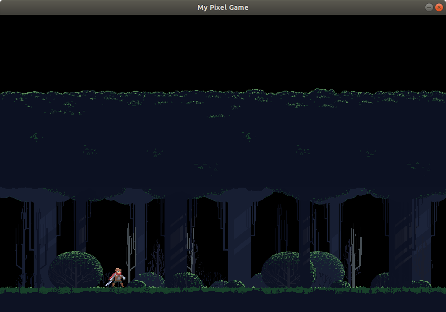
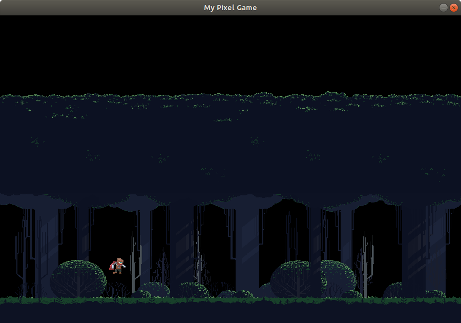

# Pixel Game 2D
> Simple 2D platformer game where you can defend your forest from the waves of zombies!

## Screenshots
Adventurer while idle:

Adventurer while jumping:

## Controls
Currently game supports two types of adventurer's movement's controll:
1. Click the mouse and character will go there
2. Navigate your character with arrows (also jump)

## TODO
Things to be added in nearest future:
1. Hitboxes and collision detection
2. Enemies spawning
3. Fighting mechanism

## Credits
1. Thanks to @rvros for his Adventurer asset pack:
    https://rvros.itch.io/animated-pixel-hero
2. Thanks to @edermunizz for his Forest asset pack:
    https://edermunizz.itch.io/free-pixel-art-forest