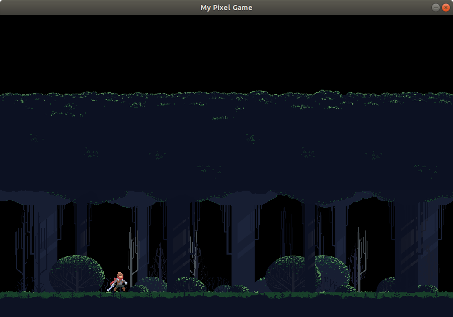
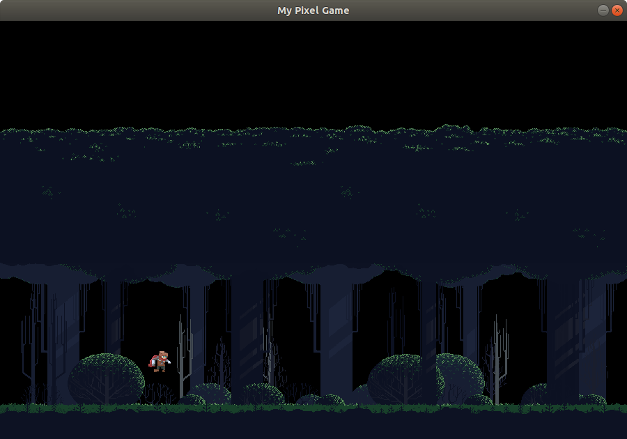
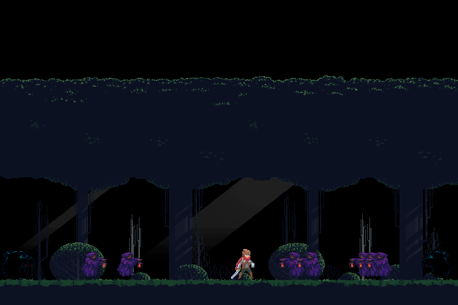
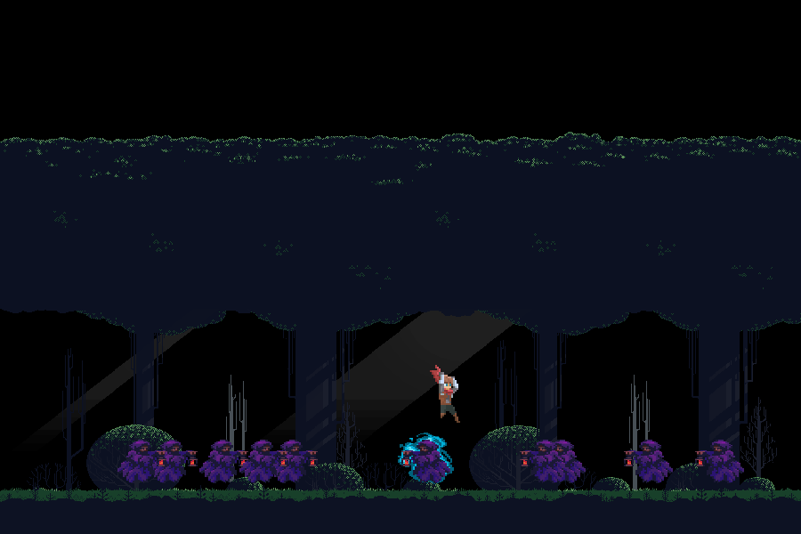

# Pixel Game 2D
> Simple 2D platformer game where you can defend your forest from the waves of zombies!

## Screenshots
Adventurer while idle:

Adventurer while jumping:

Enemies spawning from both sides:

Jumping over enemies to attack them:

## Controls
Currently game supports two types of adventurer's movement's control:
1. Click the mouse and character will go there
2. Navigate your character with arrows (also jump)

## TODO
Things to be added in nearest future:
1. ~~Hitboxes and collision detection~~ **done**
2. ~~Fighting mechanism~~ **done, yet to be improved**
3. Better *spawning* mechanism - waves of enemies
4. Custom level rendering
5. Fighting controls & attack animations
6. ...

## Credits
1. Thanks to @rvros for his Adventurer assets pack:
    https://rvros.itch.io/animated-pixel-hero
2. Thanks to @edermunizz for his Forest assets pack:
    https://edermunizz.itch.io/free-pixel-art-forest
3. Thanks to @ansimuz for his Castlevanie assets pack:
    https://ansimuz.itch.io/
